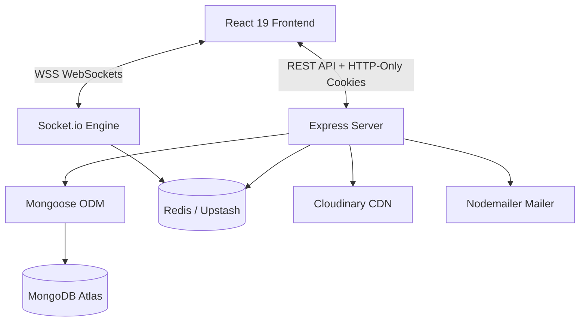
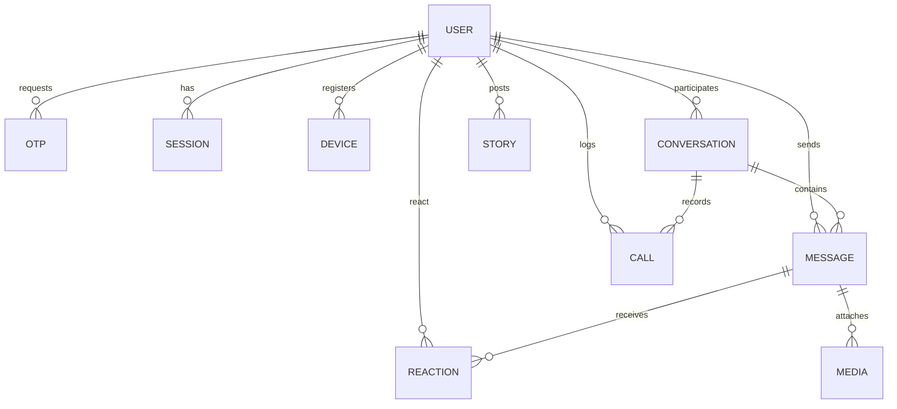

<<<<<<< HEAD
# VChats - Real-Time messaging Web Application

VChats is a production-ready, real-time messaging web application inspired by WhatsApp but designed without phone number requirements. Users register using unique usernames, email addresses, and passwords, with mandatory email verification (OTP-based) before login.

---

## Technical Stack

*   **Frontend**: React 19, Vite, Tailwind CSS, TypeScript, Redux Toolkit (global state), React Query (server cache), Axios, Framer Motion (animations), React Hook Form, Zod.
*   **Backend**: Node.js, Express, TypeScript, Socket.io (websockets), Mongoose (MongoDB ODM), JWT (access/refresh tokens with rotation), Bcrypt, Nodemailer, Multer, Cloudinary, Redis (Upstash).
*   **Database**: MongoDB Atlas.
*   **Real-time Layer**: Socket.io Server + Client.
*   **Asset CDN**: Cloudinary CDN.
*   **Containerization**: Docker & Docker Compose.

---

## System Architecture Diagram



---

## Database ER Diagram



---

## Folder Structure

```
VChats/
├── backend/
│   ├── src/
│   │   ├── config/          # db, mail, redis, cloudinary configurations
│   │   ├── controllers/     # business logic handlers (auth, user, chat, group, channel, status, call, admin)
│   │   ├── models/          # Mongoose database models (15 schemas)
│   │   ├── routes/          # Express route endpoints
│   │   ├── middlewares/     # auth protect, uploads, error handlers
│   │   ├── socket/          # socket.io authentication & event routing
│   │   ├── utils/           # jwt signing, custom AppError class
│   │   ├── validators/      # express-validator request schemas
│   │   └── index.ts         # express server bootstrap
│   ├── .env
│   ├── tsconfig.json
│   └── Dockerfile
└── frontend/
    ├── src/
    │   ├── hooks/           # useSocket, useWebRTC custom hooks
    │   ├── pages/           # LandingPage, Login, Register, VerifyOtp, ForgotPassword, ResetPassword, ChatDashboard, AdminDashboard, NotFound
    │   ├── redux/           # store, authSlice, chatSlice, callSlice
    │   ├── routes/          # AppRoutes config & route guards
    │   ├── services/        # Axios API client with automatic JWT refresh
    │   ├── styles/          # index.css with tailwind & glassmorphic themes
    │   ├── types/           # TS type definitions
    │   └── main.tsx         # React bootstrap
    ├── index.html
    ├── tsconfig.json
    ├── tailwind.config.js
    ├── postcss.config.js
    └── Dockerfile
```

---

## REST API Reference (`/api/v1`)

### Authentication (`/auth`)
*   `POST /auth/register` - Initiate user registration (sends verification OTP).
*   `POST /auth/verify-otp` - Verify OTP for registration or password reset.
*   `POST /auth/login` - Authenticate user, register device session, and return access token.
*   `POST /auth/refresh-token` - Rotate refresh tokens and return a new access token.
*   `POST /auth/logout` - Clear cookies and terminate current device session.
*   `POST /auth/logout-all` - Terminate all session instances for the user.
*   `POST /auth/forgot-password` - Sends password reset OTP.
*   `POST /auth/reset-password` - Updates user password.

### Profile (`/users`)
*   `GET /users/profile` - Fetch current user's profile and blocklist.
*   `PATCH /users/profile` - Update profile bio and theme settings.
*   `POST /users/profile/photo` - Upload profile image.
*   `GET /users/search` - Search users by handle.
*   `POST /users/block` - Block a user.
*   `POST /users/unblock` - Unblock a user.

### Chats & Messages (`/chats`, `/messages`)
*   `GET /chats` - Retrieve conversations.
*   `POST /chats/direct` - Create or retrieve a direct 1-to-1 conversation.
*   `GET /chats/:conversationId/messages` - Retrieve message history.
*   `POST /messages/send` - Send a text or media message.
*   `PATCH /messages/:id/edit` - Edit a message.
*   `DELETE /messages/:id/me` - Delete a message for current user.
*   `DELETE /messages/:id/everyone` - Delete a message for all users.
*   `POST /messages/:id/react` - Add or remove an emoji reaction.

### Groups & Channels (`/groups`, `/channels`)
*   `POST /groups/create` - Create group chat.
*   `POST /groups/:groupId/add` - Add group members.
*   `DELETE /groups/:groupId/remove/:userId` - Remove group member.
*   `POST /groups/:groupId/leave` - Leave group.
*   `POST /channels/create` - Create public or private broadcast channel.
*   `POST /channels/:channelId/follow` - Follow a channel.
*   `POST /channels/:channelId/broadcast` - Broadcast an announcement (channel owner only).

### Status Stories (`/status`)
*   `POST /status/create` - Upload an ephemeral status slide.
*   `GET /status/feed` - Fetch stories feed.
*   `POST /status/:storyId/view` - Mark a story as viewed.

### Calling History (`/calls`)
*   `GET /calls/history` - Retrieve call logs.
*   `POST /calls/log` - Create call history record.
*   `PATCH /calls/log/:id` - Update call logs (status, duration).

### Admin (`/admin`)
*   `GET /admin/stats` - Fetch system metrics dashboard.
*   `GET /admin/users` - Paginated user listings.
*   `POST /admin/users/block` - Toggle user bans.
*   `DELETE /admin/users/:targetUserId` - Permanent account deletions.
*   `POST /admin/broadcast` - System-wide broadcast warnings.

---

## Socket.io Event Spec

*   `user-online` (broadcast) - Notifies clients when user comes online.
*   `user-offline` (broadcast) - Notifies clients when user goes offline.
*   `join-room` - Joins conversation channel.
*   `leave-room` - Leaves conversation channel.
*   `typing` / `stop-typing` - Propagates typing indicators.
*   `message-receive` - Emits new messages to room.
*   `message-edit` / `message-delete` - Emits modified message updates.
*   `reaction-add` / `reaction-remove` - Real-time reaction sync.
*   `call-start` / `call-accept` / `call-reject` / `call-end` - Coordinates WebRTC call alerts.
*   `webrtc-offer` / `webrtc-answer` / `webrtc-ice-candidate` - Forwards WebRTC streams signal packets.

---

## Local Setup & Development

### 1. Backend Setup
1. Navigate to the backend directory:
   ```bash
   cd backend
   ```
2. Install node dependencies:
   ```bash
   npm install
   ```
3. Modify the environment variables in `.env`:
   *   Replace `<db_password>` in `MONGODB_URI` with your actual MongoDB user credentials.
   *   Optional: Populate Cloudinary and SMTP keys for live production services. (If left unconfigured, uploads will save locally to `uploads/` and OTP emails will write directly to the server terminal console).
4. Launch the TS development server:
   ```bash
   npm run dev
   ```

### 2. Frontend Setup
1. Navigate to the frontend directory:
   ```bash
   cd ../frontend
   ```
2. Install node dependencies:
   ```bash
   npm install
   ```
3. Launch the Vite development server:
   ```bash
   npm run dev
   ```
4. Access the web interface at `http://localhost:5173`.

---

## New Advanced Features & Improvements

We have introduced several premium features and critical bug fixes to enhance messaging, calling, and security:

### 1. Interactive Video Call Enhancements 📹
- **WebRTC Screen Sharing**: Share your screen dynamically during a video call. It swaps connection tracks seamlessly and reverts to camera feed once shared monitor is closed.
- **In-Call Reactions**: Tap bubble reactions (👍, ❤️, 😂, 🎉, 😮) to send floating emojis that rise and fade out dynamically on both callers' screens (synchronized via Socket.io and animated via `framer-motion`).
- **Real-Time Camera Filters**: Toggle and apply instant filters directly on your local video stream (Normal, Beauty ✨, Blur 🌫️, B&W 🌑, and Vintage 🎞️).

### 2. Biometric Security & Locked Chats Shortcuts 🔒
- **Biometric Login**: Sign in securely using simulated biometric fingerprint scanning on the Login screen once you have authenticated with credentials.
- **Biometric Chat Unlock**: Tap the "Locked Chats" folder to auto-trigger the biometric fingerprint scanning screen, unlocking your private chats instantly.
- **PIN Search Shortcut**: Typing your 4-digit security PIN directly into the main "Search chats..." search bar automatically unlocks and displays your private locked chats folder.

### 3. Customizable Status Durations ⏳
- Set playback durations (`10s`, `30s`, `1min`) when uploading new status stories, with timers and progress bars adapting dynamically.

### 4. Chat List & Calling Bug Fixes 🛠️
- Fixed calling race conditions where SDP offers and ICE candidates were set before camera streams were active, ensuring instant caller/receiver video synchronization.
- Resolved type mismatch issues causing offline states in headers/profile panels.
- Fixed unpopulated socket emissions causing peer names/avatars to temporarily disappear on updates.

---

## Running with Docker Compose

You can launch the entire stack using Docker Compose:
1. Ensure Docker is running.
2. In the project root directory, run:
   ```bash
   docker-compose up --build
   ```
3. The frontend is accessible at `http://localhost:8080`, and the backend maps to `http://localhost:5000`.

---

## Production Deployment Guide

### Backend -> Render
1. Push your repository to GitHub.
2. Log into **Render** and create a new **Web Service**.
3. Select the repository and configure:
   *   **Runtime**: `Node`
   *   **Build Command**: `cd backend && npm install && npm run build`
   *   **Start Command**: `cd backend && npm start`
4. Add all environment variables (from `backend/.env`) in Render's dashboard.

### Frontend -> Vercel
1. Log into **Vercel** and select **Add New Project**.
2. Select the repository and configure:
   *   **Root Directory**: `frontend`
   *   **Framework Preset**: `Vite`
   *   **Build Command**: `npm run build`
   *   **Output Directory**: `dist`
3. Add the environment variable:
   *   `VITE_API_URL` = your deployed Render backend API URL (e.g. `https://vchats-api.onrender.com/api/v1`).
   *   `VITE_SOCKET_URL` = your deployed Render socket URL (e.g. `https://vchats-api.onrender.com`).
4. Click **Deploy**.
=======
# Vchats
>>>>>>> 480f3508067f9c8d0040459704ee1ce511a7beaf
