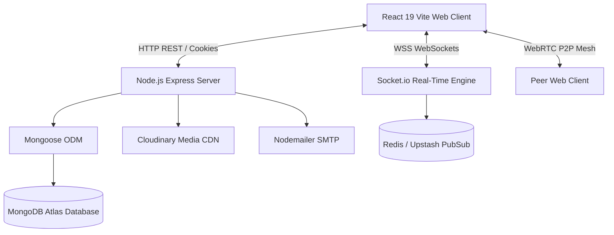

# VChats Enterprise System Architecture

---

## High-Level Architecture Diagram

---

## Component Architecture

1. **Presentation Layer (Frontend)**: Built with React 19, Redux Toolkit state slice management, Tailwind CSS glassmorphism theme, and Framer Motion micro-animations.
2. **Real-Time Communication Layer**: Socket.io duplex engine coordinating message broadcasts, typing state, read receipts, and WebRTC peer signaling.
3. **Media Processing Layer**: Multer binary parser feeding Cloudinary image/video CDN with client-side canvas editing support.
4. **AI & Intelligence Engine**: Integrated Meta AI agent endpoint assisting with text translation, message thread summaries, meeting notes extraction, and image generation.
